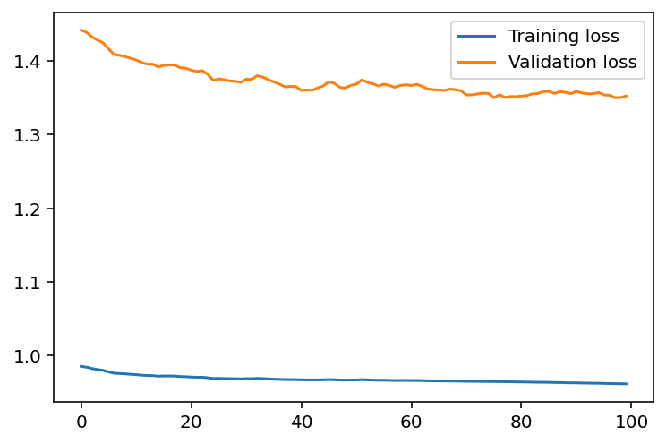
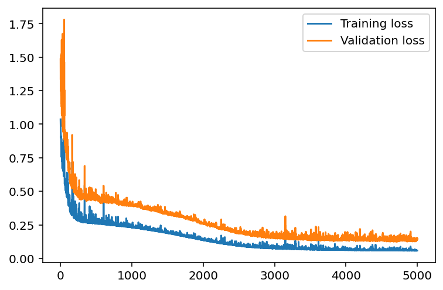
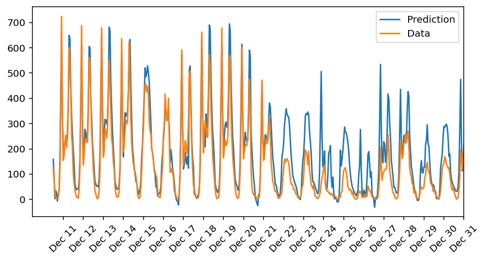

# Project Description

> In this project, I built a neural network from scratch to carry out a prediction problem on a real dataset! By building a neural network from the ground up, I had a much better understanding of gradient descent, backpropagation, and other concepts that are important to know before I move to higher-level tools such as PyTorch. I also saw how to apply these networks to solve real prediction problems!

# The architecture:

# Summary

## Losses Before Applying Hyperparameter-tuning.

> We can clearly see that the training and validation losses are high, so the model is underfitting (High Bias and Low Variance).

## Losses Before Applying Hyperparameter-tuning.

> By increasing the number of iterations to 10000, lowering the learning rate to 0.4, and making the hidden layer have only 10 nodes, the model converged to a local minimum.

## Using the model for inference on the test set :

### As a result the model performed the following:

- **Model’s Training Loss: < 0.06 and its Validation Loss: < 0.14**

- **The model predicts the first half of the test set almost correctly (from DEC,11 to DEC,21) while it slightly fails in the second half (from DEC,22to DEC,31) as we clearly see from the above plot.**

- **This failure probably happened because the model wasn’t trained enough for vacations since the end of December is the Christmas vacation!**

