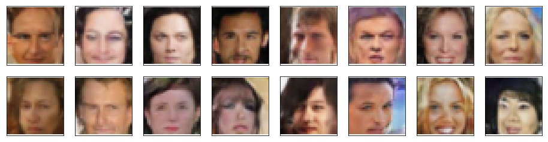

## Project Overview

In this project, I used generative adversarial networks (GANs) to generate new images of celebrity faces.

## Dataset 

I used the [CelebFaces Attributes Dataset (CelebA)](http://mmlab.ie.cuhk.edu.hk/projects/CelebA.html) to train my adversarial networks.

This dataset is more complex than the number datasets (like MNIST or SVHN) I've been working with, and so, I defined deeper networks and train them for a longer time to get good results. Additionally, I utilized a GPU for training.

## Descriminator Architecture

## Generator Architecture

## Descriminator vs. Generator Losses

## Model Output

## Limitations and Future Improvements
- The dataset needs to be more diverse and include celebrities from all races and colors to be generalized.
- The deeper the model with more epochs, the more the model will be able to catch finer details in the real images to help generate realistic fake images, on the other hand, the model will take longer to train.
- Adam optimizer seems more stable than SGD.
- Jiggling (too noisy) losses indicate that we need to increase the batch size but this will result in longer training time also can cause Cuda RunTimeError due to overuse of the GPU storage.
- The generated images have lower resolution than the real images, hence we can overcome this issue by using higher-resolution GANs. 

