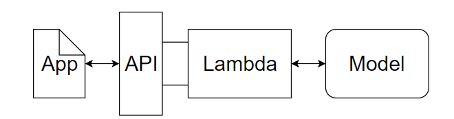
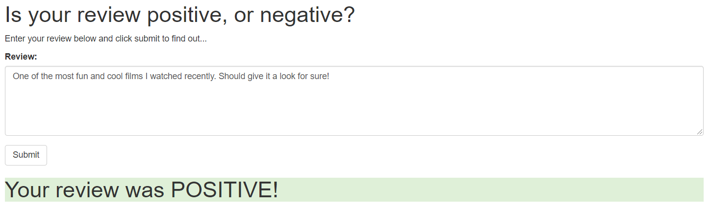
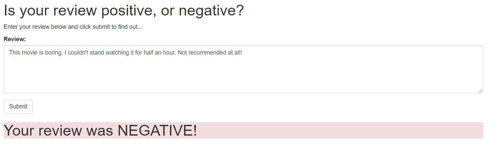

# SageMaker Sentiment Analysis Deployment Project

## Project Overview
- In this project I constructed a recurrent neural network for the purpose of determining the sentiment of a movie review using the IMDB data set. I create this model using Amazon's SageMaker service. In addition, I deployed my model and made a simple web app which interacted with the deployed model.

- The notebook and Python files provided here, result in a simple web app which interacts with a deployed recurrent neural network performing sentiment analysis on movie reviews.

## Project Flow Chart 

## Sample Reviews and their Predicted Sentiment
### Positive Review:

### Negative Review:

