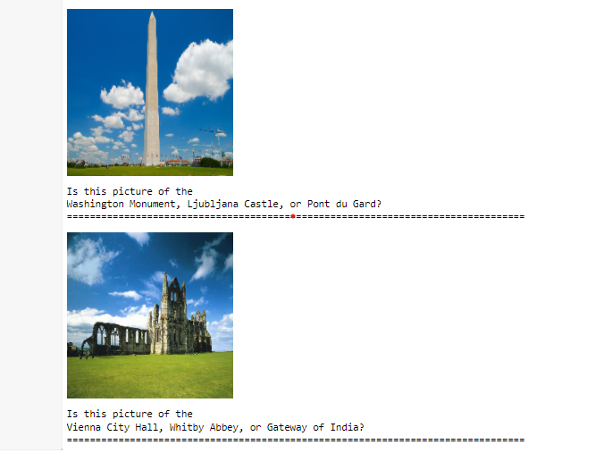

## Project Overview

In this project, I learned how to build a pipeline to process real-world, user-supplied images.
Given an image, my algorithm will predict the most likely locations where the image was taken.

## Sample Output:

## Dataset Info

The landmark images are a subset of the Google Landmarks Dataset v2. If you are seeing this on GitHub, the dataset is provided in the repo; otherwise, it can be obtained using
[this link](https://udacity-dlnfd.s3-us-west-1.amazonaws.com/datasets/landmark_images.zip).

You can find license information for the full dataset [on Kaggle](https://www.kaggle.com/google/google-landmarks-

## Model Output

> Achieved 71% accuracy using transfer learning with resnet152 however, it is considered a great performance since I'm only working on a subset of the dataset to be able to train on an average GPU.

> The model suggests the three most likely landmarks based on their probability for a given image.